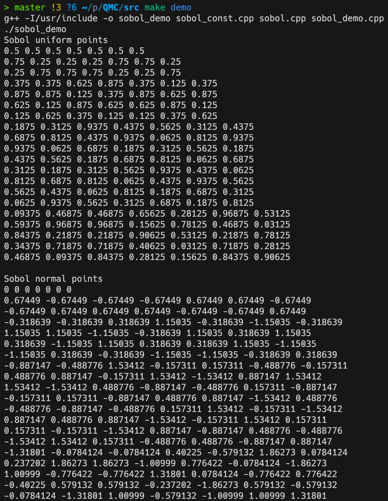

# SobolGenerator

A serial SobolGenerator with `next()` function, referenced to [https://web.maths.unsw.edu.au/~fkuo/sobol/](https://web.maths.unsw.edu.au/~fkuo/sobol/).

Generate Sobol sequences with support for dimensions up to `21201`.

## Usage

`cd src`

+ `make test`:  Testing the correctness of sequences generated from SobolGenerator.

+ `make demo`: The basic usage demo, with the uniform to normal conversion, it needs `boost` dependency (yum install boost-devel).

  

## Tested Environment

+ gcc version 8.5.0 20210514 (Red Hat 8.5.0-21) (GCC)
+ boost-devel-1.66.0-13.el8.x86_64
